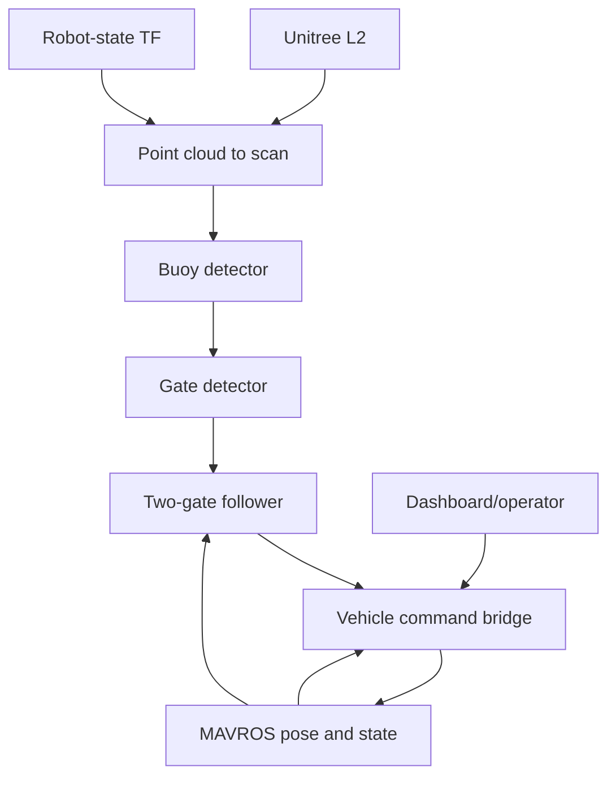

# RobotX Task 1 Runtime Interfaces

Status: Phase 4 runtime documentation  
Captured: 2026-08-31  
Platform: Ubuntu 24.04, ROS 2 Kilted  
Runtime workspace: `~/boat_ws`  
Launch: `ros2 launch boat_bringup robotx_task1.launch.py autonomy_enabled:=false`

## Scope and evidence

This document describes the current, nonworking Task 1 implementation as it actually ran. It is based on:

- a clean ROS environment containing only `/opt/ros/kilted` and `~/boat_ws/install`;
- `ros2 node list` and `ros2 node info` for the active stack;
- verbose endpoint information from `ros2 topic info --verbose`;
- runtime parameter lists;
- the current `two_gate_follower.py` source and installed YAML/configuration files.

Generated parameter-event and logging interfaces are omitted from the main tables. MAVROS plugin nodes are grouped as the MAVROS subsystem.

## Source-of-truth rule

- Build and run only from `~/boat_ws`.
- Use `~/RobotX2026-git/boat_ws` only as the Git mirror.
- Never source the Git mirror's `install/setup.bash` in a runtime shell.
- Start a fresh terminal before sourcing the runtime workspace. Sourcing one workspace after another does not remove the earlier overlay.

During Phase 4, a mixed shell was proven to launch `two_gate_follower` from the Git mirror. After restarting with a clean environment, exactly one controller ran from:

```text
/home/leo/boat_ws/install/boat_control/lib/boat_control/two_gate_follower
```

## Current architecture



The controller currently subscribes to MAVROS local pose and state. Earlier diagrams stating otherwise are obsolete. However, the local-pose connection is currently broken by incompatible QoS, documented below.

## Node interface table

| Node/subsystem | Subscriptions | Publications | Non-parameter services | Role |
|---|---|---|---|---|
| `/unitree_lidar_ros2_node` | None | `/unilidar/cloud` (`PointCloud2`), `/unilidar/imu` (`Imu`), `/tf` | `start_rotation`, `stop_rotation` (`Trigger`) | Unitree L2 driver |
| `/robot_state_publisher` | `/joint_states` (`JointState`) | `/robot_description` (`String`), `/tf`, `/tf_static` | None | Publishes the boat TF tree |
| `/pointcloud_to_laserscan` | `/unilidar/cloud` (`PointCloud2`) | `/perception/scan` (`LaserScan`) | None | Transforms and slices the 3-D cloud into the 2-D perception scan |
| `/buoy_detector` | `/perception/scan` (`LaserScan`) | `/perception/objects` (`DetectedObjectArray`), `/perception/object_markers` (`MarkerArray`) | None | Clusters and temporally confirms buoy candidates |
| `/gate_detector` | `/perception/objects` (`DetectedObjectArray`) | `/perception/gate` (`Gate`), `/perception/gate_markers` (`MarkerArray`) | None | Selects and tracks a buoy pair as a gate |
| `/two_gate_follower` | `/perception/gate` (`Gate`), `/mavros/local_position/pose` (`PoseStamped`), `/mavros/state` (`State`) | `/control/cmd_vel` (`TwistStamped`), `/mission/state` (`String`) | `/control/set_enabled` (`SetBool`), `/control/reset_mission` (`Trigger`) | Produces gate guidance and counts passages |
| `/mavros_command_bridge` | `/control/cmd_vel`, `/operator/cmd_vel` (`TwistStamped`), `/operator/deadman` (`Bool`), `/mission/state` (`String`), `/mavros/state` (`State`), `/mavros/battery` (`BatteryState`) | `/mavros/setpoint_velocity/cmd_vel` (`TwistStamped`), `/mavros/manual_control/send` (`ManualControl`), `/vehicle/battery_safety_status` (`String`) | Servers: `/vehicle/set_autonomy`, `/vehicle/software_estop` (`SetBool`), `/vehicle/reset_low_voltage` (`Trigger`); client: `/mavros/set_mode` (`SetMode`) | Sole propulsion-authority and safety boundary |
| `/esp32_status_bridge` | `/mavros/state` (`State`) | ESP32 serial commands; no application ROS topic | Client: `/mavros_command_bridge/get_parameters` | Sends E-stop/HOLD/GUIDED state to the ESP32 relay controller |
| `/boat_dashboard` | `/control/cmd_vel`, `/mavros/setpoint_velocity/cmd_vel`, `/mavros/state`, `/mavros/sys_status`, `/perception/gate`, `/perception/objects` | `/operator/cmd_vel` (`TwistStamped`), `/operator/deadman` (`Bool`) | Clients: `/control/reset_mission`, `/mavros/cmd/arming`, `/mavros/set_mode`, `/vehicle/set_autonomy`, `/vehicle/software_estop` | Operator UI, telemetry display and manual-input source |
| MAVROS subsystem | MAVLink plus ROS setpoints and commands | Vehicle state, pose, battery and other MAVROS telemetry | Arming, mode and MAVROS plugin services | ArduRover/ROS boundary |

All listed custom nodes expose the normal ROS parameter services. No custom action servers or action clients were present.

## Command and authority contract

`two_gate_follower` is a guidance generator, not the propulsion safety authority.

- It runs a 20 Hz timer and publishes a `base_link` command whenever it is enabled and has a fresh valid gate.
- It does **not** require connected, armed or GUIDED state before publishing guidance.
- MAVROS state and local pose are used only to arm and confirm gate-passage counting.
- When disabled, perception is stale, or the mission is complete, it publishes zero commands.
- `mavros_command_bridge` decides whether any autonomous or operator command is allowed to reach MAVROS.
- The bridge checks autonomy authority, software E-stop, MAVROS connection, arming, allowed mode, battery conditions and command freshness.
- Mission-complete/HOLD behavior is implemented at the bridge/safety boundary, not directly by the controller.

Therefore, seeing nonzero `/control/cmd_vel` does not prove the thrusters should move. The authoritative propulsion output is `/mavros/setpoint_velocity/cmd_vel` or `/mavros/manual_control/send`, depending on bridge mode.

## Topic QoS contract

| Topic | Publisher QoS | Subscriber QoS | Status |
|---|---|---|---|
| `/unilidar/cloud` | Reliable, volatile, keep-last 10 | `pointcloud_to_laserscan`: reliable, volatile, keep-last 6 | Compatible |
| `/perception/scan` | Best-effort, volatile, keep-last 5 | `buoy_detector`: best-effort, volatile, keep-last 5 | Compatible |
| `/perception/objects` | Reliable, volatile, keep-last 10 | `gate_detector` and dashboard: reliable, volatile, keep-last 10 | Compatible |
| `/perception/gate` | Reliable, volatile, keep-last 10 | controller and dashboard: reliable, volatile, keep-last 10 | Compatible |
| `/mavros/local_position/pose` | **Best-effort**, volatile, keep-last 5 | controller: **reliable**, volatile, keep-last 10 | **Incompatible: pose callbacks will not match** |
| `/mavros/state` | Reliable, transient-local, keep-last 10 | custom nodes: reliable, volatile, keep-last 10 | Compatible |
| `/control/cmd_vel` | Reliable, volatile, keep-last 10 | bridge and dashboard: reliable, volatile, keep-last 10 | Compatible |
| `/mission/state` | Reliable, volatile, keep-last 10 | bridge: reliable, volatile, keep-last 10 | Compatible |
| `/operator/cmd_vel` | Reliable, volatile, keep-last 10 | bridge: reliable, volatile, keep-last 10 | Compatible |
| `/operator/deadman` | Reliable, volatile, keep-last 10 | bridge: reliable, volatile, keep-last 10 | Compatible |
| `/mavros/setpoint_velocity/cmd_vel` | Bridge: reliable, volatile, keep-last 10 | MAVROS: best-effort, volatile, keep-last 5 | Compatible; a best-effort reader can accept a reliable writer |

## Coordinate frames

| Interface | Frame behavior |
|---|---|
| `/unilidar/cloud` | `lidar_link`, from `unitree_l2.yaml` |
| TF | `robot_state_publisher` provides the boat model transforms, including the `base_link` to LiDAR relationship |
| `/perception/scan` | Transformed into `base_link` by `pointcloud_to_laserscan` (`target_frame: base_link`) |
| `/perception/objects` | Inherits the scan header; therefore expected in `base_link` |
| `/perception/gate` | Explicitly published in `base_link` |
| Gate coordinates consumed by controller | Treated as `base_link`: `x` forward and `y` lateral |
| `/control/cmd_vel` | Explicit `base_link`; linear `x` is forward and angular `z` is yaw |
| Bridge output | Explicit `base_link`; MAVROS setpoint-velocity plugin configured with `mav_frame: BODY_NED` |
| `/mavros/local_position/pose` | Uses the MAVROS-provided header frame. The controller ignores `header.frame_id` and directly stores `pose.position.x/y`; the exact live frame and axis continuity still require validation |

## Parameters

### Unitree LiDAR

`baudrate`, `cloud_frame`, `cloud_scan_num`, `cloud_topic`, `imu_frame`, `imu_topic`, `initialize_type`, `lidar_ip`, `lidar_port`, `local_ip`, `local_port`, `range_max`, `range_min`, `serial_port`, `use_system_timestamp`, `work_mode`, plus standard ROS parameters and QoS overrides.

Primary configuration: `boat_sensors/config/unitree_l2.yaml`.

### Point-cloud conversion

`angle_increment`, `angle_max`, `angle_min`, `inf_epsilon`, `max_height`, `min_height`, `queue_size`, `range_max`, `range_min`, `scan_time`, `target_frame`, `transform_tolerance`, `use_inf`, plus standard ROS parameters.

Primary configuration: `boat_perception/config/lidar_perception.yaml`.

### Buoy detector

`association_distance`, `association_distance_per_meter`, `cluster_gap_base`, `cluster_gap_per_meter`, `confirm_hits`, `good_cluster_points`, `good_convexity`, `good_pca_ratio`, `markers_topic`, `max_bearing_deg`, `max_cluster_depth`, `max_cluster_width`, `max_lateral`, `max_radial_span`, `max_range`, `max_track_misses`, `min_candidate_confidence`, `min_cluster_points`, `min_cluster_width`, `min_forward_x`, `min_pca_ratio`, `min_range`, `nominal_buoy_width`, `objects_topic`, `publish_misses`, `scan_topic`, `size_tolerance`, `track_alpha`.

Primary configuration: `boat_perception/config/lidar_perception.yaml`.

### Gate detector

`center_association_distance`, `center_association_per_meter`, `confirm_hits`, `gate_topic`, `gate_width_tolerance`, `marker_topic`, `max_center_x`, `max_depth_difference`, `max_gate_skew_deg`, `max_gate_width`, `max_misses`, `min_buoy_confidence`, `min_center_x`, `min_gate_confidence`, `min_gate_width`, `min_lateral_fraction`, `nominal_gate_width`, `objects_topic`, `track_alpha`, `width_association_tolerance`.

Primary configuration: `boat_perception/config/lidar_perception.yaml`.

### Two-gate follower

| Parameter | Current value |
|---|---:|
| `gate_topic` | `/perception/gate` |
| `output_topic` | `/control/cmd_vel` |
| `state_topic` | `/mission/state` |
| `enabled` | `true` |
| `gates_required` | `2` |
| `min_gate_confidence` | `0.75` |
| `gate_timeout` | `0.30 s` |
| `forward_speed` | `0.12 m/s` |
| `yaw_kp` | `0.60` |
| `max_yaw_rate` | `0.12 rad/s` |
| `forward_angle_limit_deg` | `20 deg` |
| `passage_arm_distance` | `2.00 m` |
| `pass_loss_timeout` | `0.40 s` |
| `pass_jump_distance` | `0.40 m` |
| `pass_min_travel` | `0.75 m` |

Primary configuration: `boat_control/config/two_gate_follower.yaml`.

The MAVROS state and local-pose topic names are currently hard-coded rather than declared as parameters.

### MAVROS command bridge

`allowed_modes`, `autonomy_enabled`, `battery_critical_duration`, `battery_critical_voltage`, `battery_required_for_propulsion`, `battery_timeout`, `battery_topic`, `battery_warning_voltage`, `deadman_timeout`, `hold_retry_period`, `initial_command_timeout`, `input_topic`, `low_voltage_latched`, `manual_control_topic`, `max_forward_speed`, `max_yaw_rate`, `mission_state_topic`, `operator_input_topic`, `operator_manual_axis_max`, `operator_mode`, `operator_mode_retry_period`, `operator_timeout`, `output_topic`, `publish_rate`, `set_mode_service`, `shutdown_hold_timeout`, `software_estop`, `state_topic`, `stop_custom_mode`, `stop_mode`, `zero_command_epsilon`.

Primary configuration: `boat_vehicle/config/mavros_overrides.yaml` plus launch arguments/defaults.

### ESP32 status bridge

`baud_rate`, `send_period`, `serial_port`, plus standard ROS parameters. It also reads selected parameters from `/mavros_command_bridge`.

### Dashboard

`gate_timeout`, `min_gate_confidence`, `port`, plus standard ROS parameters.

## Verified defects and documentation consequences

### 1. Local-pose QoS mismatch

The controller constructs `/mavros/local_position/pose` with integer depth `10`, which creates a reliable subscription. MAVROS publishes this topic best-effort. DDS compatibility rules prevent that endpoint pair from matching.

Consequence: `local_x` and `local_y` can remain `None`, preventing passage arming and passage completion because the controller requires valid local position. This can make the boat continue tracking without ever advancing the mission.

Required repair: use a sensor-data/best-effort QoS profile for the local-pose subscription, then verify reception and frame continuity. This belongs in the controller/pose integration repair before passage testing.

### 2. Duplicate MAVROS-state subscription

The controller source contains two consecutive, identical calls subscribing `vehicle_state_callback` to `/mavros/state`. Runtime endpoint inspection confirms two subscriptions from the same node.

Consequence: every state message invokes the same callback twice. It is unnecessary and can duplicate state-dependent side effects.

Required repair: remove one subscription.

### 3. Guidance is not vehicle-authority gated

The controller's `update()` publishes a gate command whenever it is enabled and the gate is fresh. It does not call `vehicle_motion_ready()` before command generation.

Consequence: `/control/cmd_vel` may be nonzero while disarmed, outside GUIDED, or while autonomy is disabled. This is currently intentional only because `mavros_command_bridge` is expected to block it. Documentation and tests must treat the bridge as mandatory.

### 4. Passage logic is partial pose integration

The controller does not transform and save a fixed gate line. It records only the boat's local `x/y` position when passage arms and measures Euclidean travel from that point. Passage is then inferred from gate loss or a jump to a farther detection after minimum travel.

Consequence: this is not the planned gate-plane-crossing algorithm and can still misidentify physical gate passage.

### 5. No bounded clearing state

The current source explicitly performs no blind `CLEAR_GATE` movement. After Gate 1 is counted, it waits for or tracks another detection.

Consequence: the boat may not move far enough beyond Gate 1 to expose Gate 2. Bounded clearing remains a later implementation phase.

## Phase 4 exit assessment

The runtime interfaces are now documented and match the observed ROS graph and current controller source. Phase 4 does not certify navigation correctness. It identified two concrete wiring defects—local-pose QoS and duplicate state subscription—and clarified that pose integration, gate-plane crossing and bounded clearing are not complete.

Before physical testing, the repair sequence should continue with isolated sensor and perception validation. The pose QoS and duplicate state subscription must be corrected before any passage-detection test that relies on local position.
